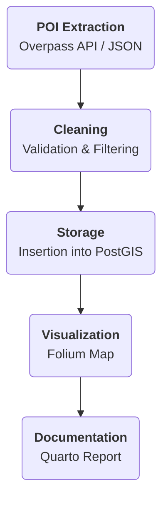

The first phase consists of collecting data. I will demonstrate that POI scraping (data extraction) is a complete approach combining technical rigor and creativity. Thanks to modern project management with Poetry and careful documentation via Quarto, it is easy to pick up this project and adapt it to other territories (such as Australia or the Philippines). Finally, this data will serve as a basis for advanced GIS analyses.

## Key points:

- Scraping and extraction: use of the Overpass API (OSM) and the Google Places API to retrieve data.
- management and processing: manipulation with Python, Pandas and Geopandas.
- spatial storage: persistence of data in a GeoJson file.
- interactive visualization: simple map made with Folium.
- modern environment: dependency management with Poetry and report produced with Quarto.

The complete interactive report details each step and presents the results.

<iframe src="https://yougis.github.io/scraping-poi-osm-googlemap/scraping_osm.html#fig-map-osm-hospitals" width="100%" height="600px"></iframe>

## What this project will be used for:

- Analyzing the distribution of businesses and services in a city or country,
- Studying competition and market trends through spatialized data.

## What you will discover:

### The 5-step approach

- **How I scrape POIs** with the OSM Overpass API and the Google Places API.
- **I will structure and store the data** in geoJson files.
- **You will be able to visualize my results** on an interactive map thanks to Folium.
- **How I manage all of this from a development environment to production** with Poetry, testing and documenting everything.

## My skills in action

Several technical skills are used in this project:

1. **Data scraping and extraction**
   - **Overpass API (OSM)**: Extract geospatial data by querying the OpenStreetMap API.
   - **Google Places API**: Retrieve additional information on POIs by querying the Google Maps API.

2. **Data management and processing**
   - **Python & Requests**: Write efficient scripts to query the APIs.
   - **Pandas & GeoPandas**: Manipulate and clean the data obtained.
   - **JSON**: Structure API responses in a readable and usable way.

3. **Interactive visualization**
   - **Folium**: Display POIs on an interactive map for immediate visualization.

4. **Documentation**
   - **Quarto**: Generate structured web and PDF reports detailing each step of the project.

5. **Environment and source code management**
   - **Poetry**: Simplifies dependency management and reproducibility of the technical environment.
   - **Git**: manages and versions the source code. It also enables continuous integration using GitHub Actions to publish the site on staging and production servers.

## Results

[View the complete interactive report](https://yougis.github.io/scraping-poi-osm-googlemap/scraping_osm.html)

This report is generated with Quarto, a modern documentation tool that combines text, code and visualizations in a single document. It is interactive and allows you to easily navigate between the different sections.

The source code is available on [Github](https://github.com/yougis/scraping-poi-osm-googlemap)

## Perspectives

This project is the first of the following series:

| Phase      | Project                                           | Key technologies                                          | Possible variations                                               | Main objective                                                                                       |
|------------|--------------------------------------------------|------------------------------------------------------------|----------------------------------------------------------------------|----------------------------------------------------------------------------------------------------------|
| Phase 1    | Scraping and management of geospatial data     | Python, Pandas, Scrapy, Overpass API, Google Maps API, PostGIS, folium/leaflet     | Extraction from OSM and Google Maps, 3 geographic zones and 3 scales (city, province, state/country) | Build a common geospatial database usable by the following phases                   |
| Phase 2    | Geospatial workflow automation            | Prefect, Python, PostGIS                                   | Setting up an automated ETL to update the database       | Automate the extraction and updating of geospatial data                                      |
| Phase 3    | Interactive 3D visualization           | Deck.gl,  Streamlit, PostGIS                   | Interactive 3D mapping, comparison between different web mapping technologies   | Dynamically and interactively present the stored data                                         |
| Phase 4    | Spatial analysis and modeling with H3          | H3, Python (GeoPandas, Folium), QGIS                        | Study of flows and densities (mobility, urban infrastructure)      | Use the data to perform advanced spatial analyses and demonstrate their added value       |
| Phase 5    | Publication and sharing via GeoNode               | GeoNode, Django, PostGIS , CKAN                                  | Creation of a data portal, interactive catalog, API integration | Promote and share the results via an accessible and collaborative web platform                  |