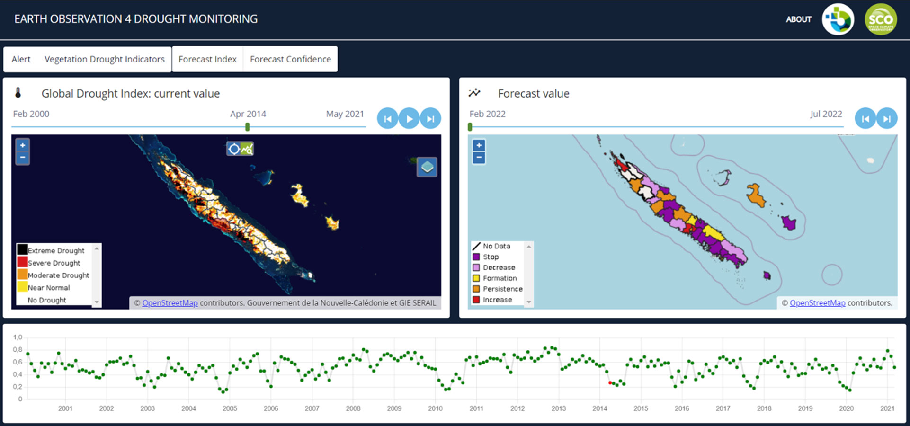
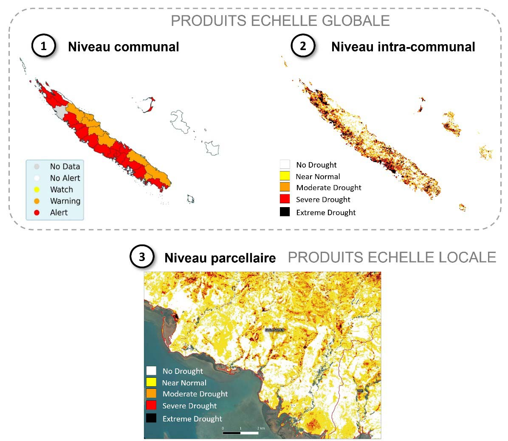
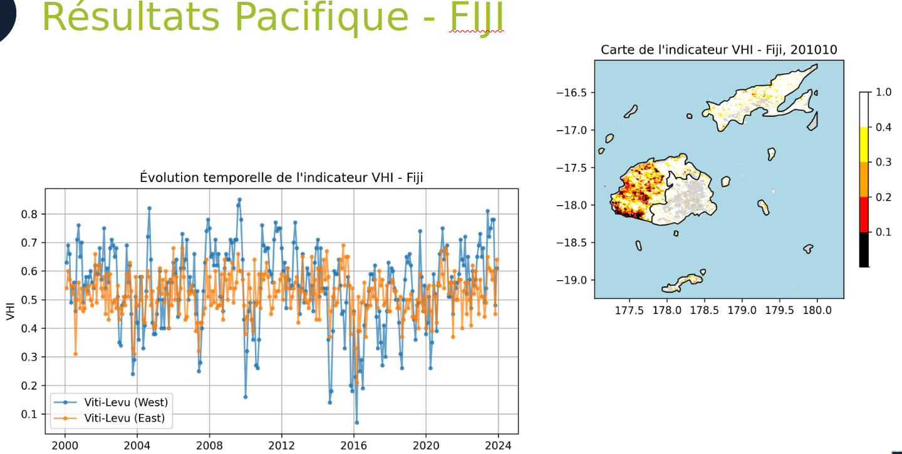

This project follows on from the work carried out under the Space Climate Observatory project, named EO4DroughtMonitoring1 in New Caledonia, with the main objective of demonstrating the applicability and usefulness of such a tool in other Pacific island territories. The overall approach is to have a process adapted to all Pacific island territories that could subsequently be delivered as an open-access operational service in partnership with the region's key stakeholders.

In the context of this project, we carried out:

- the construction of a vegetation drought indicator capable of characterizing the current situation as well as historical and forecast situations, depending on the data available from the various satellite platforms and meteorological instruments of the territories concerned,
- the production deployment of the indicator in New Caledonia, with the aim of demonstrating the operational nature of the solution,
- the adaptation of the production chain for certain territories in the Pacific region,
- the promotion of the data through interfaces and consultation and distribution services.





[View the full interactive report by clicking this link](https://yougis.github.io/EO4DM-Rapports/rapport_execution.html)