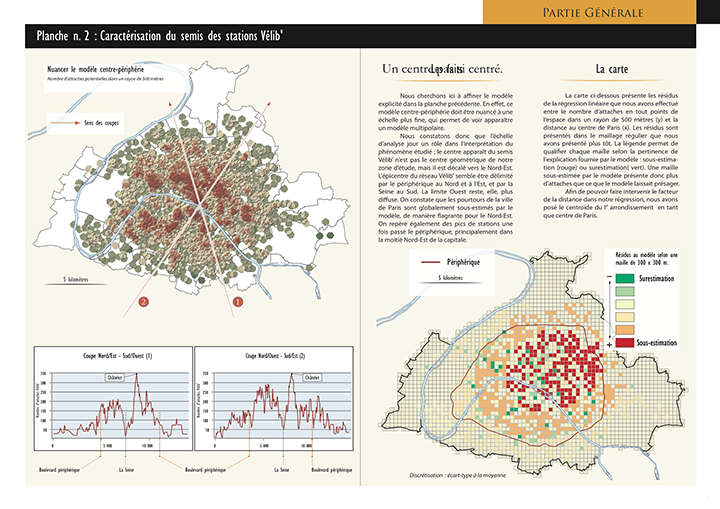
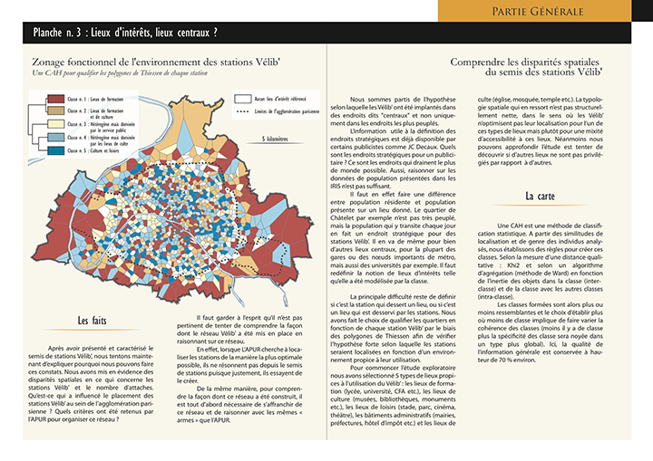
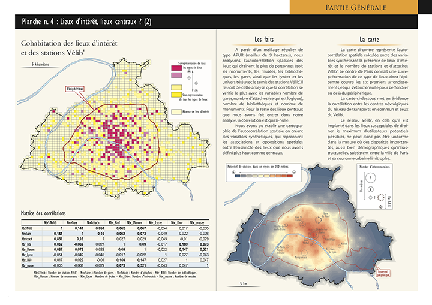
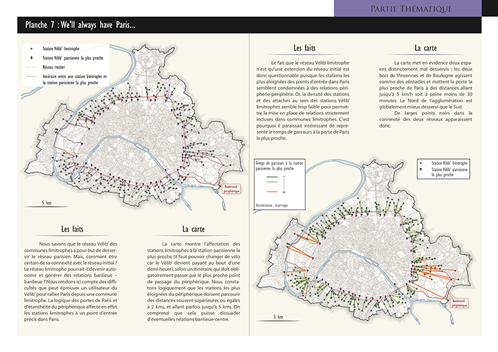
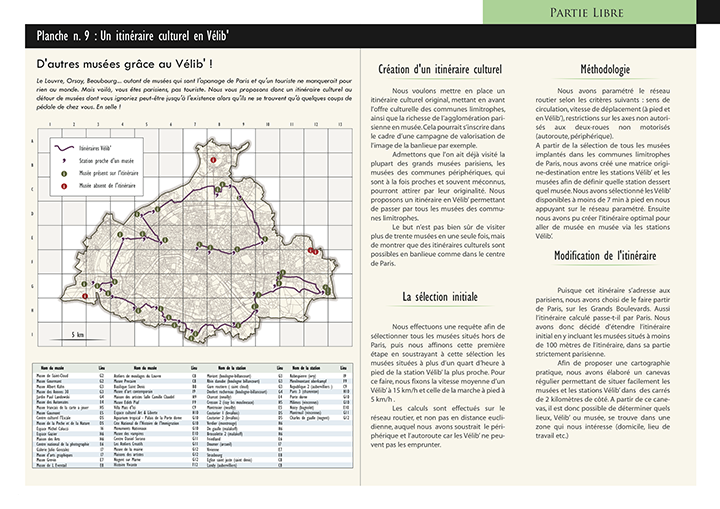

Projet mené à quatre mains avec [Jules Grandin](http://julesgrandin.com).

Analyse spatiale, simulation de parcours, Classification acendantes Hierarchiques, statistiques multivariées, réalisation de la maquette, des cartes et des textes.

## Galerie d’images


  
  
  
  
  
  
  
  
  
  
  
  


## Compétences exploitées et livrables 
Adobe illustrator
QGIS
Data Visualisation
Data Management
Analyse de données