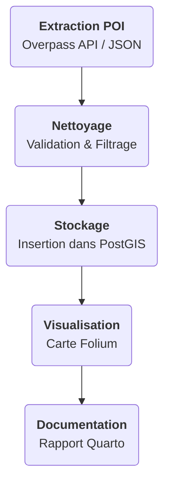

La phase 1 conciste á recolter des donnés disponibles. Je vais vous démontrer que le scraping de POI (extraction de données), est une démarche complète qui allie rigueur technique et créativité. Grâce à une gestion moderne du projet avec Poetry et à une documentation soignée via Quarto, il est aisé de reprendre ce projet, de l'adapter à d'autres territoires (comme l'Australie ou les Philippines) et de servir de base pour des analyses SIG avancées.

## Les points clés :

- scraping et extraction : utilisation de l'Overpass api (OSM) et de Google Places API pour récupérer des données.
- gestion et traitement : manipulation avec Python, Pandas et Geopandas.
- stockage spatial : insertion dans Postgis via Psycopg2.
- visualisation interactive : carte simple réalisée avec Folium.
- environnement moderne : gestion des dépendances avec Poetry et rapport produit avec Quarto.

Le rapport complet et interactif détail chaque étape et présente les résultats. Pour en savoir plus, consultez le rapport interactif détaillé via ce lien :

[Consulter le rapport interactif complet](https://yougis.github.io/scraping-poi-osm-googlemap/scraping_osm.html) 

Pour un apercu rapide du projet je vous propose de consulter le contenu du rapport intégré ci dessous:

<iframe src="https://yougis.github.io/scraping-poi-osm-googlemap/scraping_osm.html#fig-map-osm-hospitals" width="100%" height="600px"></iframe>

## Exemple de cas d’usage addressés :

- L’analyse de la répartition des commerces et des services d'une ville ou un pays,
- L’étude de la concurrence et des tendances du marché via des données spatialisées.

## Ce que vous allez découvrir :
- **Comment je scrapes des POI** avec l'Overpass API d'OSM et la Google Places API.
- **Je vais structurer et stocker les données** dans des fichiers CSV, Excel geoJson et même dans une base PostGIS 
- **Vous permettre de visualiser mes résultats** sur une carte interactive grâce à Folium.
- **Comment je gére tout cela d'un environnement de developpement à la production** avec Poetry, tester et documenter le tout.

## Mes compétences en action

Plusieurs compétences techniques sont déployées dans ce projet :

1. **Scraping et extraction de données**
   - **Overpass API (OSM)** : Extraire des données géospatiales en interrogeant l'API d'OpenStreetMap.
   - **Google Places API** : Récupérer des informations complémentaires sur les POI en interrogeant l'API de google map.

2. **Gestion et traitement de données**
   - **Python & Requests** : Rédiger des scripts efficaces pour interroger les API.
   - **Pandas & GeoPandas** : Manipuler et nettoyer les données obtenues.
   - **JSON** : Structurer les réponses API de façon lisible et exploitable.

3. **Visualisation interactive**
   - **Folium** : Afficher les POI sur une carte interactive pour une visualisation immédiate.

4. **Documentation**
   - **Quarto** : Générer des rapports interactifs et bien documentés qui détaillent chaque étape du projet.

5. **Gestion de l'environnement et du code source**
   - **Poetry** : Simplifier la gestion des dépendances et la reproductibilité de l'environnement technique.
   - **Git** : gérer et versionner le code source, ainsi que de mettre en place l'intégration continue avec l'usage des actions Github pour publier le site sur le serveur de production.

## La démarche en 5 étapes

##  Perspectives

Ce projet est le premier de la serie suivante : 

| Phase      | Projet                                           | Technologies clés                                          | Déclinaisons possibles                                               | Objectif principal                                                                                       |
|------------|--------------------------------------------------|------------------------------------------------------------|----------------------------------------------------------------------|----------------------------------------------------------------------------------------------------------|
| Phase 1    | Scraping et gestion des données géospatiales     | Python, Pandas, Scrapy, Overpass API, Google Maps API, PostGIS, folium/leaflet     | Extraction depuis OSM et Google Maps, 3 zones géographiques et 3 échelles (ville, province, état/pays) | Construire une base de données géospatiales commune exploitable par les phases suivantes                   |
| Phase 2    | Automatisation du workflow géospatial            | Prefect, Python, PostGIS                                   | Mise en place d’un ETL automatisé pour la mise à jour de la base       | Automatiser l’extraction et l’actualisation des données géospatiales                                      |
| Phase 3    | Visualisation interactive en 3D           | Deck.gl,  Streamlit, PostGIS                   | Cartographie interactive en 3D, comparaison entre différentes technologies web carto   | Présenter de façon dynamique et interactive les données stockées                                         |
| Phase 4    | Analyse spatiale et modélisation avec H3          | H3, Python (GeoPandas, Folium), QGIS                        | Étude des flux et densités (mobilité, infrastructures urbaines)      | Exploiter les données pour réaliser des analyses spatiales avancées et démontrer leur valeur ajoutée       |
| Phase 5    | Publication et partage via GeoNode               | GeoNode, Django, PostGIS , CKAN                                  | Création d’un portail de données, catalogue interactif, intégration d’API | Valoriser et partager les résultats via une plateforme web accessible et collaborative                  |
