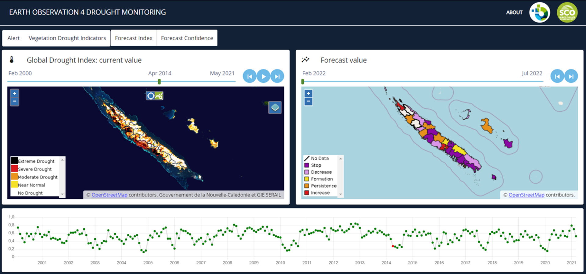
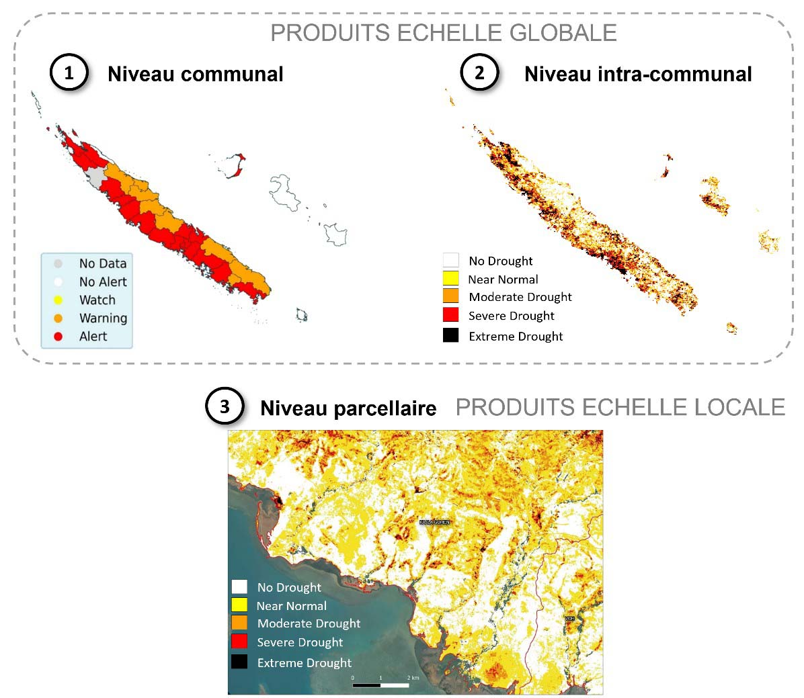
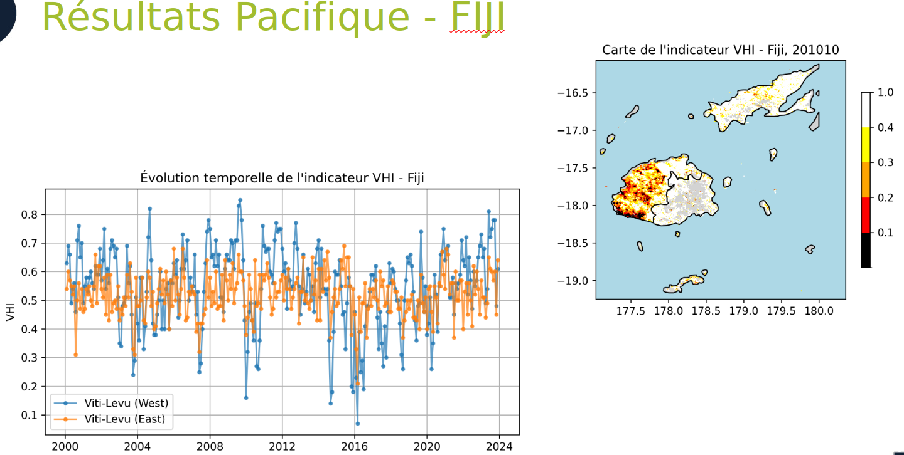

Le projet proposé ici s’inscrit dans la continuité du travail mené dans le cadre du projet Space Climate Observatory, nommé EO4DroughtMonitoring1 sur la Nouvelle-Calédonie avec comme objectif principal de démontrer l’applicabilité et l’utilité d’un tel outil dans d’autres territoires insulaires du Pacifique. La démarche globale est ainsi de disposer d’un procédé adapté pour l’ensemble des territoires insulaires du Pacifique et qui pourrait par la suite être délivré en libre accès de façon opérationnelle en lien avec les acteurs centraux de la région.

Nous avons réalisé dans le cadre de ce projet :

  - la construction d'un indicateur de sécheresse végétale permettant de caractériser la situation actuelle mais aussi historique et prévisionnelle, en fonction des données disponibles, obtenues sur les différents plateformes satellitaires et des instruments météorologiques du territoires concernés,
  - la mise en en production l’indicateur sur la Nouvelle-Calédonie, l’objectif étant de démontrer le caractère opérationnel de la solution,
    décliner la chaine de production pour certains territoires de la région Pacifique,
  - valoriser à travers des interfaces et des services de consultation et de mise à disposition des données.





[Consulter le rapport interactif complet en cliquant sur ce lien](https://yougis.github.io/EO4DM-Rapports/rapport_execution.html)

